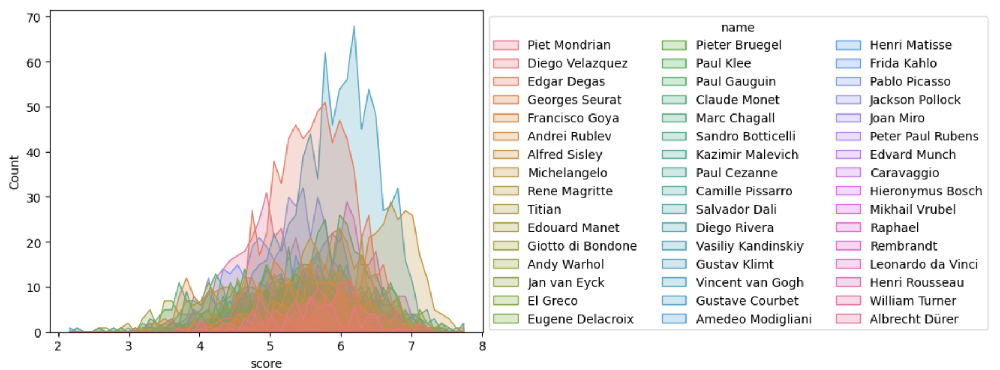

# Hmm... oooohmhuhhhh



## Installation

```bash
python -m venv venv
source venv/bin/activate

pip install -r requirements.txt
pip install git+https://github.com/openai/CLIP.git
```

## Usage

```bash
python rank_images.py images/
```

## Exploration

```bash
pip install ipykernel
python -m ipykernel install --user --name simulacra

jupyter-lab
```

## References

* https://stackoverflow.com/questions/7908636/how-to-add-hovering-annotations-to-a-plot
* https://stackoverflow.com/questions/14261903/how-can-i-open-the-interactive-matplotlib-window-in-ipython-notebook
* https://stackoverflow.com/questions/52346254/importerror-failed-to-import-any-qt-binding-python-tensorflow
* https://seaborn.pydata.org/generated/seaborn.histplot.html